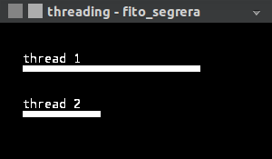
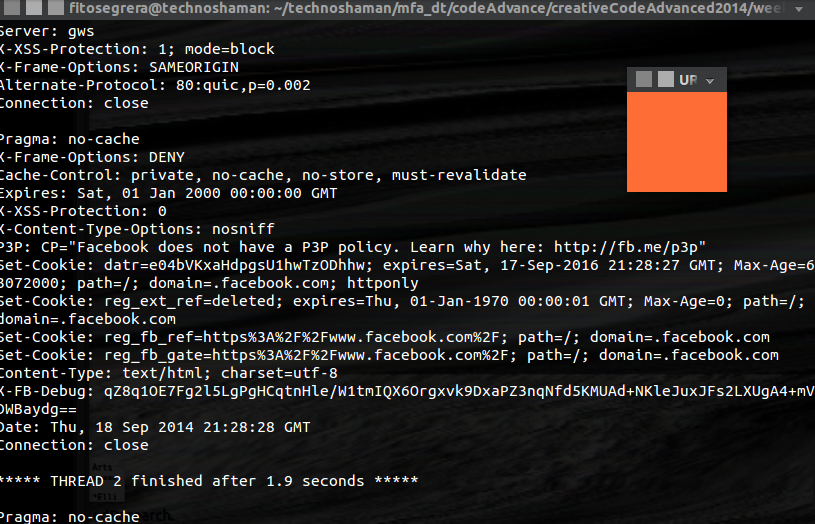

Threads Python
========================

In this repo you will find 2 files:

**threads.py** --> creates two threads with processes running with different timings. It shows loading bars to represent visually the process of each thread. It is inspired in the processing example for threads.

**url_threads.py** --> creatres 3 threads. Two of the are doing hhtp requests to multiple websites and the third one has a visual operation.

